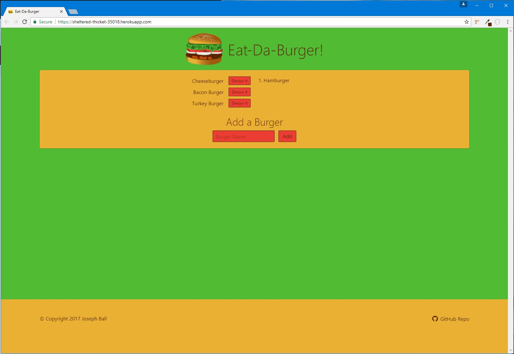

# Burger
A restaurant app that lets users input the names of burgers they'd like to eat.

## Overview
A web page that lets users interact with a database to store burgers they want to eat and subsequently eat them.

## Functionality
Front-end is built with `HTML`, `CSS`, and `Bulma CSS`. Back-end is built with `Node`, `Express`, `handlbars`, and `sequelize`. The database used is a `MySQL` database.

## Screenshot

## Tech used

    "HTML": "5",
    "CSS": "3",
    "Bulma": "0.99.0",
    "JavaScript": "ECMA-262",
    "Node": "6.11.0 LTS",
    "Express": "4.15.3",
    "Handlebars": "3.0.0",
    "Sequelize": "4.3.2"
    "MySQL": "5.7.18",

## Authors
*Rutgers Codding Bootcamp Project*
* **Joseph Ball** - [josephtball](https://github.com/josephtball)